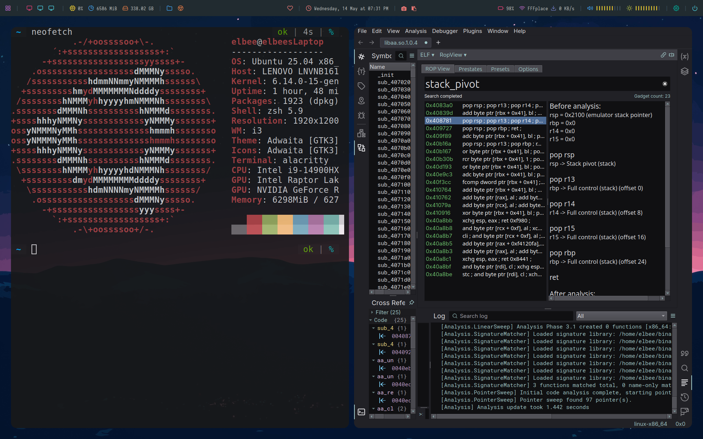

# workstation-debian-rice
Minimalist rice for my Debian machine
- Uses i3, picom, rofi, polybar (https://github.com/adi1090x/polybar-themes), pywal
- Includes installer (only tested on Debian)
- I SWEAR I DONT RUN KALI

